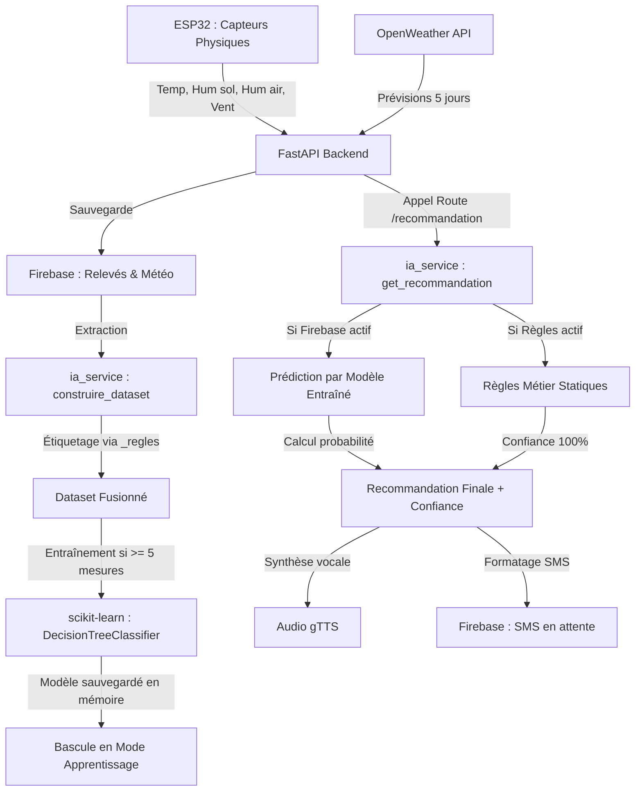

# Fonctionnement de l'IA et Génération de Recommandations

Ce document explique en détail le fonctionnement du pipeline d'Intelligence Artificielle de la **Station Météo Agricole**, depuis la collecte des données physiques jusqu'à la génération du conseil et l'envoi du SMS.

---

## 1. Vue d'ensemble du Flux

Le système suit un cycle continu de collecte, labellisation, entraînement et prédiction :



---

## 2. Les Variables d'Entrée (8 Features)

Le modèle s'appuie sur **8 indicateurs clés** pour prendre ses décisions :

| Feature | Source | Unité | Description |
| :--- | :--- | :--- | :--- |
| `temperature` | ESP32 | °C | Température actuelle de l'air |
| `humidite_air` | ESP32 | % | Humidité relative actuelle de l'air |
| `humidite_sol` | ESP32 | % | Humidité du sol mesurée par la sonde capacitive |
| `vitesse_vent` | ESP32 | km/h | Vitesse actuelle du vent |
| `pluie_prevue_3h` | OpenWeather | mm | Volume de pluie prévu dans les 3 prochaines heures |
| `temperature_future` | OpenWeather | °C | Température maximale prévue pour le prochain créneau |
| `humidite_future` | OpenWeather | % | Humidité de l'air prévue |
| `vent_future` | OpenWeather | km/h | Vitesse du vent prévue |

---

## 3. L'Arbre de Décision Initial (Règles Métier)

Au démarrage ou en l'absence de données suffisantes, le système utilise un **arbre de décision statique** déterministe (fonction `_regles`). Les règles sont évaluées dans l'ordre de priorité suivant :

1.  **💨 Vitesse du vent excessive** (Actuelle $\ge 45\text{ km/h}$ ou Prévue $\ge 40\text{ km/h}$)
    *   *Classe 4* : Reporter la pulvérisation (le vent disperse les intrants).
2.  **🌧️ Pluie imminente** (Pluie prévue $\ge 3\text{ mm}$ et humidité du sol $< 60\%$)
    *   *Classe 5* : Attendre la pluie (l'irrigation artificielle est inutile).
3.  **🚨 Stress hydrique critique** (Humidité du sol $\le 20\%$ et Température $\ge 30^\circ\text{C}$)
    *   *Classe 2* : Urgence - Stress hydrique sévère (irrigation immédiate requise).
4.  **💧 Humidité du sol basse** (Humidité du sol $\le 25\%$ et pluie prévue $< 3\text{ mm}$)
    *   *Classe 1* : Arroser les cultures.
5.  **🍄 Conditions favorables aux maladies** (Humidité de l'air $\ge 80\%$ et Température $\ge 28^\circ\text{C}$)
    *   *Classe 3* : Risque fongique (traitement préventif conseillé).
6.  **✅ Conditions normales** (Aucune des conditions ci-dessus)
    *   *Classe 0* : Conditions favorables.

---

## 4. Phase 1 : Constitution du Dataset

Lorsque l'administrateur déclenche le ré-entraînement pour une station :
1.  **Récupération de l'Historique** : Le serveur télécharge l'historique des capteurs de la station sur Firebase (jusqu'aux 2000 derniers relevés) et les prévisions OpenWeather historiques associées.
2.  **Labellisation automatique** : Pour chaque relevé historique, la fonction `_regles` est appelée avec les 8 paramètres pour déterminer quel aurait été le conseil optimal à cet instant précis.
3.  **Nettoyage & Remplacement des Nulls** : La fonction `safe_float` intercepte et corrige les éventuelles valeurs manquantes (`None`) pour éviter les erreurs de type pendant l'entraînement.
4.  **Enregistrement** : Le dataset complet est écrit dans Firebase sous `stations/{station_id}/dataset` avec des clés séquentielles (`0001`, `0002`...).

---

## 5. Phase 2 : Entraînement scikit-learn

L'entraînement transforme les règles statiques en un modèle prédictif adaptatif en mémoire :

```python
modele = DecisionTreeClassifier(max_depth=8, random_state=42)
modele.fit(X, y)
```

### Protection contre les plantages (Stratification)
Lors du découpage des données (80% entraînement, 20% test) pour évaluer la précision du modèle :
*   Le système compte les membres de chaque classe (`Counter(y)`).
*   Si **toutes** les classes ont au moins **2 échantillons**, le découpage utilise `stratify=y` pour conserver la même proportion de classes dans le jeu de test.
*   Si une classe n'a qu'**un seul échantillon**, la stratification est automatiquement désactivée pour éviter un plantage de scikit-learn.

### Changement de mode
Dès que l'entraînement réussit :
1.  L'instance globale `_classifieur` passe de `_ClassifieurRegles` (statique) à `_ClassifieurSklearn` (dynamique).
2.  Les prédictions suivantes utilisent l'arbre de décision entraîné.

---

## 6. Phase 3 : Génération et Envoi de Recommandations

Chaque fois que l'ESP32 pousse de nouvelles mesures ou que l'agriculteur consulte son tableau de bord :

1.  **Prédiction** : Le modèle actif (`_classifieur`) prend les 8 mesures courantes et prédit l'indice de classe (0 à 5).
2.  **Calcul de Confiance** : 
    *   En mode règles : La confiance est fixe à `100%`.
    *   En mode Firebase : La confiance est calculée par la méthode `predict_proba` du modèle de scikit-learn. Elle représente la certitude statistique de l'arbre de décision.
3.  **Lecture Vocale (TTS)** : Le conseil détaillé est synthétisé en fichier audio MP3 en français (ou wolof selon configuration) via `gTTS` pour les agriculteurs peu alphabétisés.
4.  **Envoi du SMS** :
    *   Le conseil est couplé à la mesure et formaté (limite de 160 caractères).
    *   Le texte du SMS est nettoyé par `_sms_clean` (conversion en alphabet standard GSM-7bit pour éviter les caractères incompatibles avec les puces SIM7600E).
    *   Le SMS est écrit dans Firebase sous `stations/{station_id}/sms_a_envoyer`.
    *   L'ESP32 interroge cette branche et transmet physiquement le SMS sur le téléphone de l'agriculteur.
