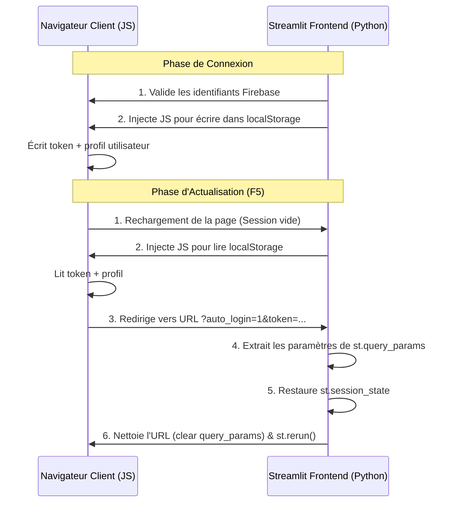

# Persistance des Sessions et Reconnexion Automatique

Ce document décrit le fonctionnement du système de reconnexion automatique mis en place sur le frontend Streamlit de la **Station Météo Agricole** pour éviter la perte de connexion lors des rafraîchissements de page.

---

## 1. Le Problème Initial (Cycle de vie de Streamlit)

Par défaut, Streamlit est une application serveur qui communique avec le navigateur via une connexion WebSocket permanente :
*   Le statut de connexion de l'utilisateur est conservé dans l'état de session en mémoire vive (`st.session_state`) côté serveur.
*   **Perte de session :** Lors d'un rafraîchissement de page (touche F5 ou bouton d'actualisation), la connexion WebSocket est interrompue puis recréée. Streamlit réinitialise alors `st.session_state` à zéro.
*   L'utilisateur se retrouve déconnecté et redirigé systématiquement vers le formulaire de connexion.

---

## 2. La Solution : Persistance Hybride localStorage & Paramètres d'URL

Pour pallier ce problème sans ajouter de dépendances de paquets lourds (comme des gestionnaires de cookies externes), nous avons conçu un mécanisme d'échange bidirectionnel sécurisé en JavaScript et Python :



---

## 3. Détails Techniques de l'Implémentation

### Étape A : Enregistrement de la Session
Lorsqu'un utilisateur se connecte avec succès dans le fichier [auth.py](file:///c:/Users/HP/Downloads/Agri_Station_meteo_restyled/Agri_Station_meteo/frontend/components/auth.py#L260), un bloc de code JavaScript est injecté dans le navigateur pour enregistrer les données :

```javascript
var storage;
try { 
    storage = window.parent.localStorage; // Essaie d'accéder au localStorage principal
} catch(e) { 
    storage = window.localStorage;        // Fallback en cas de sandbox/iframe CORS
}
if (storage) {
    storage.setItem("session_uid", "...");
    storage.setItem("session_token", "...");
    storage.setItem("session_role", "...");
    storage.setItem("session_nom", "...");
    storage.setItem("session_email", "...");
    storage.setItem("session_station_id", "...");
    storage.setItem("session_station_nom", "...");
    storage.setItem("session_region", "...");
    storage.setItem("session_authenticated", "true");
}
```

### Étape B : Restauration de la Session au Démarrage
Dans [app.py](file:///c:/Users/HP/Downloads/Agri_Station_meteo_restyled/Agri_Station_meteo/frontend/app.py#L216), si l'état `st.session_state.authenticated` est absent, le serveur injecte un script JS pour vérifier le `localStorage`. S'il trouve `session_authenticated === "true"`, il redirige vers la même URL en passant les paramètres d'auto-connexion.

Le serveur Python intercepte ces paramètres, reconstruit l'état de session, puis nettoie instantanément l'URL :

```python
# ── Extraction dans app.py ──
query_params = st.query_params

if "auto_login" in query_params:
    st.session_state.authenticated = True
    st.session_state.id_token      = query_params.get("token")
    st.session_state.role          = query_params.get("role")
    st.session_state.uid           = query_params.get("uid")
    st.session_state.nom           = query_params.get("nom")
    st.session_state.email         = query_params.get("email")
    st.session_state.station_id    = query_params.get("station_id")
    st.session_state.station_nom   = query_params.get("station_nom")
    st.session_state.region        = query_params.get("region")

    st.query_params.clear() # Nettoyage de la barre d'adresse
    st.rerun()
```

### Étape C : Déconnexion Propre
Lors du clic sur le bouton "Déconnecter" ([auth.py](file:///c:/Users/HP/Downloads/Agri_Station_meteo_restyled/Agri_Station_meteo/frontend/components/auth.py#L360)) :
1.  Le JavaScript vide le `localStorage` du navigateur.
2.  L'URL est modifiée pour inclure le drapeau `?logging_out=1` (ce qui empêche le script de démarrage de tenter une reconnexion immédiate).
3.  L'état de session en mémoire serveur est détruit par `st.session_state.clear()`.

---

## 4. Sécurité et Robustesse
*   **Nettoyage de l'adresse URL :** L'adresse du navigateur est débarrassée des jetons et des données personnelles immédiatement après la reconnexion automatique grâce à `st.query_params.clear()`, évitant ainsi le vol de session ou l'affichage de données sensibles dans l'historique de navigation.
*   **Compatibilité Iframe / Sandbox :** Le double ciblage (`window.parent.localStorage` et `window.localStorage`) assure que la reconnexion fonctionne de manière transparente même si l'application Streamlit est hébergée sur des serveurs tiers (ex. Render, Streamlit Cloud) et intégrée dans un site tiers sous forme de conteneur iframe.
