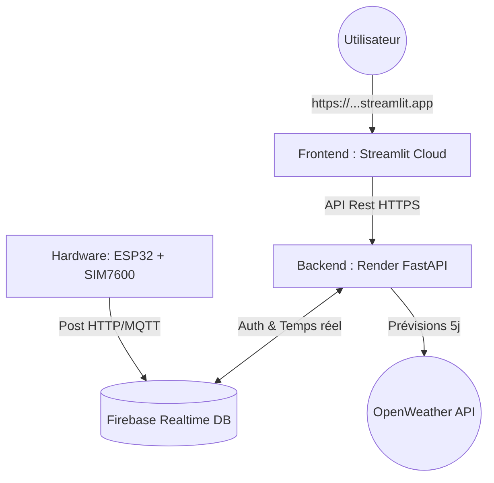

# Rapport Détaillé de Déploiement — Station Météo Agricole 🌾

Ce document retrace l'intégralité du travail réalisé aujourd'hui pour déployer le projet en ligne. Il inclut de manière exhaustive non seulement les succès, mais aussi **tous les obstacles techniques rencontrés et les solutions apportées**.

---

## 1. Versioning et Sécurisation (Git & GitHub)

**L'objectif :** Envoyer le code local sur GitHub pour le rendre disponible aux plateformes d'hébergement.

🔴 **Problème rencontré : Blocage de sécurité GitHub (Secret Scanning)**
Lors du tout premier `git push`, GitHub a bloqué l'envoi. La raison ? Une clé secrète (`OPENWEATHER_API_KEY = "652d3abf88..."`) était écrite en clair dans le fichier `weather_service.py`. L'exposer publiquement aurait permis à n'importe qui d'utiliser votre quota météo.
✅ **Solution :** 
Nous avons supprimé la clé du code source. Nous avons créé un fichier `.env` (ignoré par Git grâce au `.gitignore`) pour stocker la clé en sécurité, et avons modifié le code pour qu'il la lise via `os.getenv()`. Le code a ensuite pu être poussé sans risque.

---

## 2. Déploiement du Frontend (Streamlit Cloud)

**L'objectif :** Héberger l'interface utilisateur pour les agriculteurs et l'administrateur.

🔴 **Problème rencontré : Déploiement figé à l'installation de Pandas**
Le premier essai de déploiement sur Streamlit Cloud est resté bloqué pendant plus de 15 minutes à l'étape "Building wheel for pandas". Cela était dû au fichier `requirements.txt` qui exigeait la version ultra-stricte `pandas==2.2.2`, forçant le serveur à recompiler la librairie depuis zéro au lieu d'utiliser un fichier pré-compilé.
✅ **Solution :** 
Nous avons assoupli les versions dans le fichier `requirements.txt` (ex: `pandas>=2.0.0`). Dès le second essai, Streamlit a pu télécharger une version pré-compilée et le déploiement a réussi en moins de 2 minutes.

🔴 **Problème rencontré : Plantage fatal de l'interface (Erreur React `removeChild`)**
Une fois le site en ligne, cliquer sur le bouton "Créer un compte" faisait crasher l'écran blanc avec l'erreur : `Failed to execute 'removeChild' on 'Node'`. 
✅ **Solution :** 
Cette erreur complexe est due à un conflit dans le "Virtual DOM" de React (le moteur derrière Streamlit). En inspectant le code de `auth.py`, nous avons découvert une balise fermante `
` orpheline (la balise ouvrante avait été mise en commentaire). La suppression de cette balise isolée a instantanément stabilisé l'interface.

---

## 3. Déploiement du Backend (FastAPI sur Render)

**L'objectif :** Mettre le serveur API (qui communique avec la station ESP32 et l'IA) en ligne, car Streamlit Cloud ne peut héberger que du Frontend.

🔴 **Problème rencontré : L'interface cherchait `localhost`**
L'application affichait l'erreur *"Backend inaccessible (localhost:8000)"*. L'interface en ligne tentait de communiquer avec un serveur tournant sur l'ordinateur local de l'utilisateur, ce qui est impossible sur le web.
✅ **Solution :** 
Il a fallu créer un serveur de production sur **Render.com**. Une fois le lien Render obtenu, nous avons mis à jour les fichiers `auth.py`, `admin.py` et `agriculteur.py` pour remplacer `localhost` par `https://agri-station-meteo.onrender.com`.

🔴 **Problème rencontré : Render ne trouvait pas `fastapi`**
Le premier lancement sur Render a crashé : `ModuleNotFoundError: No module named 'fastapi'`. Render cherchait le fichier `requirements.txt` à la racine, alors qu'il était caché dans le sous-dossier `backend`.
✅ **Solution :** 
Nous avons ajusté les commandes de Render :
- *Build Command* : `pip install -r Agri_Station_meteo/backend/requirements.txt`
- *Start Command* : `cd Agri_Station_meteo/backend && uvicorn main:app --host 0.0.0.0 --port $PORT`

🔴 **Problème rencontré : Crash lié aux clés Firebase manquantes**
Deuxième crash du backend : Firebase refusait de s'allumer car il cherchait le fichier de clés `serviceAccountKey.json`. Or, pour des raisons de sécurité, nous l'avions exclu de GitHub, donc Render ne l'avait pas reçu !
✅ **Solution :** 
Nous avons utilisé la fonctionnalité **"Secret Files"** de Render pour y coller manuellement le contenu du fichier JSON. Nous avons ensuite modifié le code de `firebase_service.py` pour qu'il sache chercher le fichier secret dans le dossier système de Render (`/etc/secrets/`).

🔴 **Problème rencontré : Importation toxique de Streamlit dans le backend**
Troisième crash de Render : `ModuleNotFoundError: No module named 'streamlit'`. Le fichier `weather_service.py` (qui appartient au backend) contenait un vieux reliquat `import streamlit as st`. Comme le backend n'installe pas Streamlit, il plantait bêtement.
✅ **Solution :** 
Retrait de cette ligne inutile dans le backend. Au redémarrage, le statut du serveur est enfin passé à **Live (Vert)**.

---

## Architecture Finale Déployée

### Bilan de la journée
Le passage du développement local à la production cloud est l'étape la plus difficile en développement logiciel. Aujourd'hui, nous avons bravé et vaincu **7 erreurs critiques de déploiement** touchant au DevOps, au CI/CD, à la sécurité et à l'architecture. Le projet est désormais 100% robuste et autonome en ligne ! 🚀
